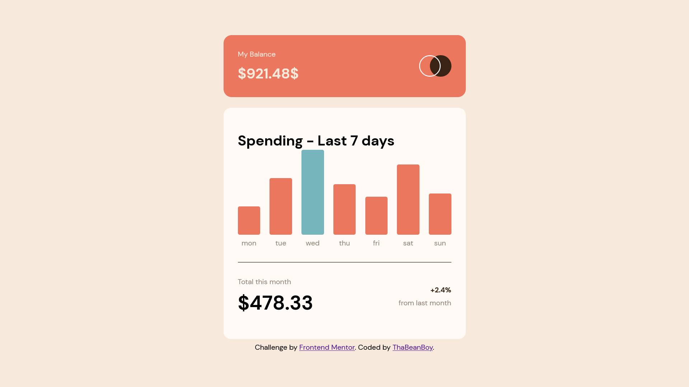
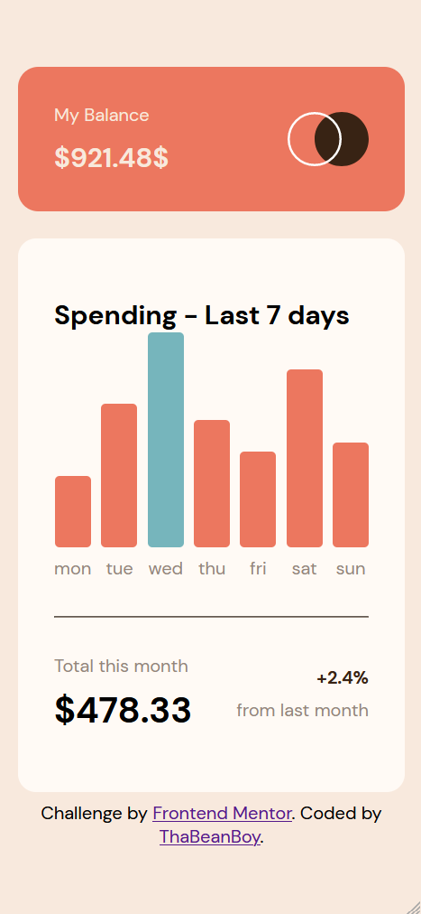

# Frontend Mentor - Expenses chart component solution

This is a solution to the [Expenses chart component challenge on Frontend Mentor](https://www.frontendmentor.io/challenges/expenses-chart-component-e7yJBUdjwt). Frontend Mentor challenges help you improve your coding skills by building realistic projects.

## Table of contents

- [Frontend Mentor - Expenses chart component solution](#frontend-mentor---expenses-chart-component-solution)
  - [Table of contents](#table-of-contents)
  - [Overview](#overview)
    - [The challenge](#the-challenge)
    - [Screenshot](#screenshot)
    - [Links](#links)
    - [Built with](#built-with)
    - [What I learned](#what-i-learned)
    - [Continued development](#continued-development)
    - [Useful resources](#useful-resources)
  - [Author](#author)

## Overview

### The challenge

Users should be able to:

- View the bar chart and hover over the individual bars to see the correct amounts for each day
- See the current day’s bar highlighted in a different colour to the other bars
- View the optimal layout for the content depending on their device’s screen size
- See hover states for all interactive elements on the page
- **Bonus**: Use the JSON data file provided to dynamically size the bars on the chart

### Screenshot

### Links

- [Live Site](https://frontendmentorexpenseschartcom.gatsbyjs.io/)
- [Repo](https://github.com/ThaBeanBoy/Front-End-Mentor-Expenses-Chart-Component)
- [React](https://reactjs.org/)
- [Gatsby](https://www.gatsbyjs.com/)
- [Framer Motino](https://www.framer.com/motion/)
- [Sass/Scss](https://sass-lang.com/)

### Built with

- Desktop-first workflow
- Flexbox
- [React](https://reactjs.org/) - JS library
- [Gatsby Js](https://www.gatsbyjs.com/) - React framework for Static Site Generation
- [Sass/Scss](https://sass-lang.com/) - For styles

### What I learned

This is the first time experimenting with Gatsby. The development experience was great.

One thing that was a painfull experience, was NPM. I experienced a couple of peer depency errors. After a while, I experienced dependancy problems. I think this may because I used a [Gatsby starter project](https://www.gatsbyjs.com/starters/gatsbyjs/gatsby-starter-hello-world) which initially came with Gatsby^2. This experience taught me the basic of dev dependancy & how different modules dependend are compatible with different versions of other modules.

### Continued development

In this project, I was really hoping to experiece the Gatsby's GraphQL layer & how Gatsby optimizes iumages. Unfortunately this project only had an svg logo. I saw no purposes of trying to optimize the svg image, so I just put in the static directory.

Another point of interest for me is the use of [gatsby-source-filesystem](https://www.npmjs.com/package/gatsby-source-filesystem).

### Useful resources

- [Gatsby](https://www.gatsbyjs.com/) - This was as a Static Site Generator.
- [Gatsby Cloud](https://www.gatsbyjs.com/products/cloud/) - This was used to Host the site.
- [Framer Motion](https://www.framer.com/motion/) - Animation library for animating in React
- [Sass/Scss](https://sass-lang.com/) - Used for styling

## Author

- Website - [tiin_giib_chiip](https://github.com/ThaBeanBoy)
- Frontend Mentor - [@ThaBeanBoy](https://www.frontendmentor.io/profile/ThaBeanBoy)
- Instagram - [@tiin_giib_chiip](https://www.instagram.com/tiin_giib_chiip/)
- Linkedin - [Gibbs Chipoyera](https://www.linkedin.com/in/gibbs-chipoyera-0948b9193/)
